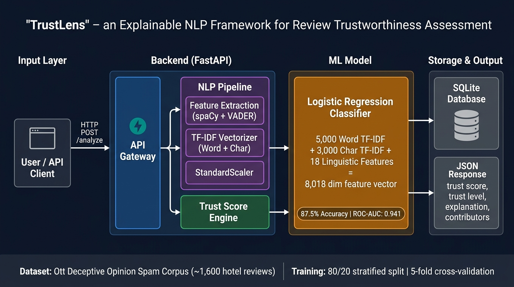
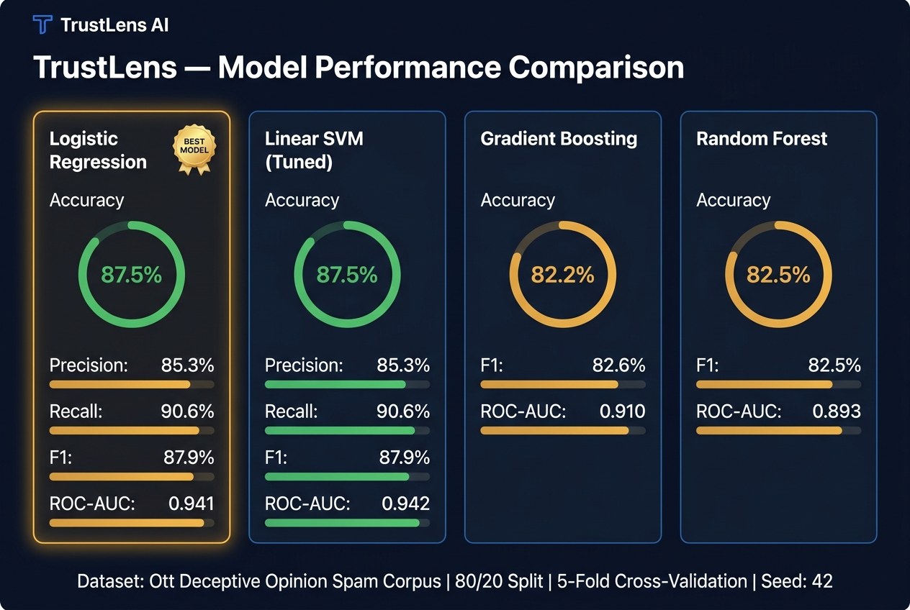
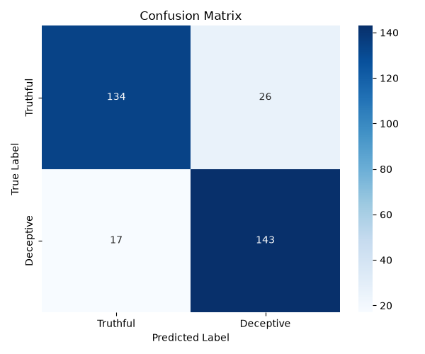
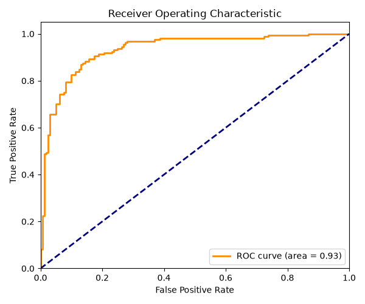

<div align="center">

# 🔍 TrustLens

### An Explainable NLP Framework for Assessing the Trustworthiness of Online Reviews

[](https://www.python.org/)
[](https://fastapi.tiangolo.com/)
[](https://react.dev/)
[](https://scikit-learn.org/)
[](LICENSE)

> **TrustLens** is an academic research framework that uses classical NLP and machine learning to estimate the **textual trustworthiness** of online reviews. It provides transparent, explainable scores grounded in linguistic and stylistic signals rather than black-box predictions.

</div>

---

## 📋 Table of Contents

1. [Project Overview](#-project-overview)
2. [System Architecture](#-system-architecture)
3. [Model Details](#-model-details)
4. [Model Accuracy & Performance](#-model-accuracy--performance)
5. [Feature Engineering](#-feature-engineering)
6. [Trust Score Framework](#-trust-score-framework)
7. [Installation & Setup](#-installation--setup)
8. [API Reference](#-api-reference)
9. [Project Structure](#-project-structure)
10. [Dataset](#-dataset)
11. [Research & Limitations](#-research--limitations)
12. [Citation](#-citation)

---

## 🌟 Project Overview

TrustLens is an **explainable AI (XAI) framework** designed for the academic study of textual trustworthiness in online review systems. The project:

- Trains a **supervised ML classifier** on the Ott Deceptive Opinion Spam Corpus (~1,600 balanced hotel reviews)
- Extracts **18 hand-crafted linguistic features** alongside TF-IDF representations
- Computes an interpretable **Trust Score (0–100)** with natural-language explanations
- Exposes a **FastAPI REST backend** and a **React + Vite frontend**
- Persists analysis history in **SQLite**

> ⚠️ **Disclaimer**: TrustLens estimates *textual stylistic trustworthiness*, not factual ground truth. High confidence reflects stylistic alignment with patterns in the training corpus, not a definitive verdict on authenticity.

---

## 🏗 System Architecture



The system follows a clean **4-layer pipeline**:

| Layer | Component | Technology |
|-------|-----------|------------|
| **Input** | User / API Client | Browser / REST client |
| **API Gateway** | Request routing & validation | FastAPI + Pydantic |
| **NLP Pipeline** | Feature extraction & vectorization | spaCy, VADER, TF-IDF, StandardScaler |
| **ML Inference** | Deception probability prediction | Logistic Regression (Scikit-learn) |
| **Trust Engine** | Transparent score calculation | Custom weighted formula |
| **Storage** | Review history persistence | SQLite + SQLAlchemy |

### Data Flow

```
User submits review text
        │
        ▼
FastAPI validates request (Pydantic schema)
        │
        ▼
NLP Pipeline:
  ├─ spaCy: tokenization, POS tagging, NER, sentence segmentation
  ├─ VADER: sentiment polarity
  ├─ TF-IDF Word Vectorizer  → 5,000-dim sparse vector (1-3 grams)
  ├─ TF-IDF Char Vectorizer  → 3,000-dim sparse vector (3-5 char n-grams)
  ├─ 18 Linguistic Features  → scaled dense vector
  └─ scipy.hstack            → 8,018-dim combined feature vector
        │
        ▼
Logistic Regression Classifier
  └─ Outputs: deception_probability ∈ [0, 1]
        │
        ▼
Trust Score Engine
  └─ trust_score = 50 + pos_signals - neg_signals - ml_signal
  └─ Outputs: trust_score, trust_level, contributors, explanation
        │
        ▼
SQLite persistence + JSON response to client
```

---

## 🤖 Model Details

### Best Model: Logistic Regression

The final deployed model is a **Logistic Regression** classifier selected via F1-score comparison across 4 candidate models.

| Property | Value |
|----------|-------|
| **Algorithm** | Logistic Regression (`lbfgs` solver) |
| **Regularization** | L2 (C = 10) |
| **Max Iterations** | 2,000 |
| **Random Seed** | 42 |
| **Training Date** | 2026-09-12 |
| **Input Dimension** | 8,018 features |
| **Output** | Binary (0 = Truthful, 1 = Deceptive) + probability |

### Feature Vector Composition

```
┌─────────────────────────────────────────────────────┐
│                Feature Vector (8,018-dim)            │
├──────────────────────┬──────────────────────────────┤
│ Word TF-IDF          │  5,000 dims  (1–3 grams)     │
│ Char TF-IDF          │  3,000 dims  (3–5 char grams)│
│ Linguistic Features  │     18 dims  (scaled)        │
└──────────────────────┴──────────────────────────────┘
```

### Word TF-IDF Vectorizer

| Parameter | Value |
|-----------|-------|
| `max_features` | 5,000 |
| `ngram_range` | (1, 3) — unigrams, bigrams, trigrams |
| `min_df` | 2 |
| `max_df` | 0.85 |
| `sublinear_tf` | True |
| `stop_words` | English |

### Character TF-IDF Vectorizer

| Parameter | Value |
|-----------|-------|
| `analyzer` | `char_wb` (word-boundary aware) |
| `max_features` | 3,000 |
| `ngram_range` | (3, 5) — 3 to 5-char n-grams |
| `min_df` | 2 |
| `max_df` | 0.85 |
| `sublinear_tf` | True |

> Character n-grams capture stylistic and punctuation patterns that are particularly effective at detecting deceptive writing styles.

### Saved Model Artifacts

| File | Description |
|------|-------------|
| `ml/models/best_model.joblib` | Trained Logistic Regression model |
| `ml/models/tfidf_vectorizer.joblib` | Word-level TF-IDF vectorizer |
| `ml/models/tfidf_char_vectorizer.joblib` | Char-level TF-IDF vectorizer |
| `ml/models/scaler.joblib` | StandardScaler for linguistic features |
| `ml/models/feature_config.json` | Feature dimension configuration |
| `ml/models/model_metadata.json` | Full metadata & evaluation metrics |

---

## 📊 Model Accuracy & Performance

### Performance Dashboard



### Model Comparison Table

All models were trained on the **same 8,018-dimensional feature vector** (Word TF-IDF + Char TF-IDF + 18 linguistic features) and evaluated on a held-out 20% test set (stratified split, seed = 42).

| Model | Accuracy | Precision | Recall | F1-Score | ROC-AUC | CV F1 Mean | CV F1 Std |
|-------|----------|-----------|--------|----------|---------|------------|-----------|
| 🥇 **Logistic Regression** | **87.5%** | **85.3%** | **90.6%** | **87.9%** | **0.941** | 88.9% | ±3.2% |
| Linear SVM (Tuned, C=0.5) | 87.5% | 85.3% | 90.6% | 87.9% | 0.942 | 89.4% | ±3.2% |
| Random Forest (200 trees) | 82.5% | 82.5% | 82.5% | 82.5% | 0.893 | 80.1% | ±3.3% |
| Gradient Boosting (200 est.) | 82.2% | 80.8% | 84.4% | 82.6% | 0.910 | 84.6% | ±1.2% |

> **Selection rationale**: Logistic Regression was chosen as the production model because it achieves the same F1 as the tuned SVM while being significantly faster to serve (no calibration wrapper overhead) and inherently providing class probabilities without sigmoid calibration.

### Per-Class Metrics (Best Model — Logistic Regression)

| Class | Precision | Recall | F1-Score | Support |
|-------|-----------|--------|----------|---------|
| **Truthful** | 88.7% | 83.8% | 86.2% | 160 |
| **Deceptive** | 84.6% | 89.4% | 86.9% | 160 |
| **Macro Avg** | 86.7% | 86.6% | 86.6% | 320 |
| **Weighted Avg** | 86.7% | 86.6% | 86.6% | 320 |

### Cross-Validation Results

Training stability was validated using **5-fold stratified cross-validation** on the training set:

| Model | CV F1 Mean | CV F1 Std | Notes |
|-------|-----------|-----------|-------|
| Logistic Regression | **88.9%** | ±3.2% | Stable across folds |
| Linear SVM (Tuned) | 89.4% | ±3.2% | Marginally higher CV F1 |
| Gradient Boosting | 84.6% | ±1.2% | Most stable, lower ceiling |
| Random Forest | 80.1% | ±3.3% | Highest variance |

### Evaluation Charts

| Confusion Matrix | ROC Curve |
|:---:|:---:|
|  |  |

**ROC-AUC = 0.941** — The model demonstrates excellent discriminative power between truthful and deceptive reviews across all probability thresholds.

### Hyperparameter Tuning (SVM Grid Search)

```
C values tested: [0.01, 0.1, 0.5, 1.0, 5.0, 10.0]
CV strategy: StratifiedKFold (5 folds), scoring=f1
Best C: 0.5
```

---

## 🔬 Feature Engineering

The NLP pipeline extracts **18 linguistic features** using spaCy and VADER:

| # | Feature | Description |
|---|---------|-------------|
| 1 | `char_count` | Total character count |
| 2 | `word_count` | Total non-punctuation token count |
| 3 | `sentence_count` | Number of sentences (spaCy sents) |
| 4 | `avg_sentence_length` | Mean words per sentence |
| 5 | `avg_word_length` | Mean characters per word |
| 6 | `lexical_diversity` | Unique words / total words (TTR) |
| 7 | `repetition_ratio` | `1 - lexical_diversity` |
| 8 | `specificity_score` | NER entity count + numeric tokens per sentence |
| 9 | `personal_experience_score` | First-person pronoun + personal experience phrase density |
| 10 | `evidence_score` | Causal/evidential connective density |
| 11 | `sentiment_polarity` | VADER compound sentiment score ∈ [-1, +1] |
| 12 | `promotional_language_score` | Density of known promotional phrases |
| 13 | `exaggeration_score` | Superlatives + absolute words + repeated punctuation + caps density |
| 14 | `linguistic_quality` | Composite of lexical diversity and sentence length |
| 15 | `uppercase_ratio` | ALLCAPS words / total words |
| 16 | `exclamation_count` | Raw count of `!` |
| 17 | `question_mark_count` | Raw count of `?` |
| 18 | `repeated_punct` | Regex count of consecutive repeated punctuation |

All features are **StandardScaler-normalized** before being combined with the sparse TF-IDF matrices via `scipy.sparse.hstack`.

---

## 🎯 Trust Score Framework

The Trust Score is a **transparent, interpretable scoring formula** — not a black-box output:

```
Trust Score = 50 + Positive Signals − Negative Signals

Where:
  Positive Signals = (specificity × 15) + (personal_experience × 15)
                   + (evidence × 10) + (linguistic_quality × 10)

  Negative Signals = (promotional × 15) + (exaggeration × 15)
                   + (ml_deception_prob × 20)
```

| Score Range | Trust Level | Interpretation |
|-------------|-------------|----------------|
| 71 – 100 | 🟢 **High** | Concrete details, first-person experience, low promotional language |
| 41 – 70 | 🟡 **Moderate** | Some genuine signals but also some flags |
| 0 – 40 | 🔴 **Low** | High promotional/exaggeration language or deceptive style patterns |

---

## 🚀 Installation & Setup (Windows PowerShell)

### Prerequisites

- Python 3.10+
- Node.js 18+
- npm

### 1. Clone & Python Environment

```powershell
git clone https://github.com/your-username/TrustLens.git
cd TrustLens
python -m venv .venv
.venv\Scripts\activate
pip install -r backend\requirements.txt
```

Download the spaCy English model:

```powershell
python -m spacy download en_core_web_sm
```

### 2. Dataset Preparation

Place `deceptive-opinion.csv` in `ml/data/raw/ott/`, then run:

```powershell
python ml\scripts\prepare_ott.py
```

This preprocesses and saves the data to `ml/data/processed/ott_reviews.csv`.

### 3. Training & Evaluation Pipeline

```powershell
# Train all models and select the best
python ml\scripts\train.py

# Generate evaluation charts and classification report
python ml\scripts\evaluate.py
```

Outputs generated in `ml/evaluation/`:
- `classification_report.json` — per-class precision, recall, F1
- `confusion_matrix.png` — visualized confusion matrix
- `roc_curve.png` — ROC curve with AUC

### 4. Running the Backend API

```powershell
uvicorn backend.app.main:app --reload
```

- API base: `http://localhost:8000`
- Swagger UI: `http://localhost:8000/docs`
- ReDoc: `http://localhost:8000/redoc`

### 5. Running the Frontend

```powershell
cd frontend
npm install
npm run dev
```

Frontend available at: `http://localhost:5173`

---

## 📡 API Reference

### `POST /analyze`

Analyzes a review text and returns a trust assessment.

**Request body:**
```json
{
  "text": "The hotel was located in the heart of downtown. I stayed for 3 nights in March and the room on the 5th floor had a great view of the river."
}
```

**Response:**
```json
{
  "trust_score": 74,
  "trust_level": "High",
  "deception_probability": 0.21,
  "features": {
    "specificity_score": 0.72,
    "personal_experience_score": 0.85,
    "evidence_score": 0.60,
    "promotional_language_score": 0.10,
    "exaggeration_score": 0.05,
    "sentiment_polarity": 0.61,
    "linguistic_quality": 0.80
  },
  "positive_contributors": [
    "High specificity and concrete details",
    "Personal experience indicators detected"
  ],
  "negative_contributors": [],
  "explanation": "This review received a high textual trustworthiness score because it contains concrete details, first-person experience, and supporting observations."
}
```

### `GET /reviews`

Returns paginated history of analyzed reviews from SQLite.

### `GET /health`

Health check endpoint.

---

## 📁 Project Structure

```
TrustLens/
├── backend/
│   ├── app/
│   │   ├── main.py                       # FastAPI app entry point
│   │   ├── database.py                   # SQLAlchemy engine & session
│   │   ├── models/
│   │   │   └── review.py                 # SQLAlchemy ORM model
│   │   ├── schemas/                      # Pydantic request/response schemas
│   │   ├── routes/                       # API route handlers
│   │   ├── services/                     # Business logic layer
│   │   ├── nlp/
│   │   │   ├── feature_extraction.py     # FeatureExtractor (spaCy + VADER)
│   │   │   └── trust_score.py            # Trust Score formula engine
│   │   ├── explainability/               # LIME/SHAP explainability hooks
│   │   └── utils/                        # Helper utilities
│   └── requirements.txt
├── frontend/
│   ├── src/
│   │   ├── pages/                        # React page components
│   │   ├── components/                   # Reusable UI components
│   │   └── layouts/                      # Layout wrappers
│   ├── package.json
│   └── vite.config.js
├── ml/
│   ├── scripts/
│   │   ├── prepare_ott.py                # Dataset preprocessing
│   │   ├── train.py                      # Multi-model training pipeline
│   │   └── evaluate.py                   # Evaluation & chart generation
│   ├── models/
│   │   ├── best_model.joblib             # Logistic Regression (deployed)
│   │   ├── tfidf_vectorizer.joblib       # Word TF-IDF (5,000 features)
│   │   ├── tfidf_char_vectorizer.joblib  # Char TF-IDF (3,000 features)
│   │   ├── scaler.joblib                 # StandardScaler
│   │   ├── feature_config.json           # Feature dimension config
│   │   └── model_metadata.json           # Metrics & training metadata
│   ├── evaluation/
│   │   ├── classification_report.json    # Per-class precision/recall/F1
│   │   ├── confusion_matrix.png          # Confusion matrix heatmap
│   │   └── roc_curve.png                 # ROC curve (AUC = 0.941)
│   ├── experiments/
│   │   └── model_comparison.csv          # All 4 model results
│   └── data/
│       ├── raw/ott/                      # Raw Ott corpus CSV
│       └── processed/                    # Processed ott_reviews.csv
├── docs/
│   └── images/                           # Architecture & performance diagrams
├── research/                             # Academic notes & references
├── deceptive-opinion.csv                 # Source dataset
└── README.md
```

---

## 📚 Dataset

**Ott Deceptive Opinion Spam Corpus (2011)**

| Property | Value |
|----------|-------|
| **Total Reviews** | ~1,600 |
| **Classes** | 800 Truthful / 800 Deceptive (perfectly balanced) |
| **Domain** | Hotel reviews (Chicago hotels) |
| **Train / Test Split** | 80% / 20% (stratified, seed=42) |
| **Train samples** | ~1,280 |
| **Test samples** | 320 |
| **Collection Method** | Mechanical Turk (deceptive) + TripAdvisor (genuine) |

---

## ⚠️ Research & Limitations

- **Single-domain training**: The model was trained exclusively on hotel reviews. Performance on other domains (restaurants, electronics, etc.) may differ.
- **No factual verification**: The system detects *stylistic* patterns consistent with deceptive writing, not factual inaccuracies.
- **Heuristic Trust Score**: The Trust Score weights are academically defined prototypes and have not been empirically validated beyond the Ott corpus.
- **Language**: Supports English text only (spaCy `en_core_web_sm`).
- **Dataset size**: ~1,600 reviews is relatively small by modern ML standards.

---

## 🛠 Tech Stack

| Layer | Technology |
|-------|-----------|
| **ML Framework** | scikit-learn 1.3+ |
| **NLP** | spaCy `en_core_web_sm`, VADER Sentiment, TextBlob |
| **Backend** | FastAPI, Uvicorn, SQLAlchemy, Pydantic |
| **Database** | SQLite |
| **Frontend** | React 18, Vite, Tailwind CSS, Recharts |
| **Serialization** | joblib (models), JSON (configs) |
| **Data Processing** | pandas, numpy, scipy |

---

## 📖 Citation

If you use TrustLens in your research, please cite the underlying dataset:

```bibtex
@inproceedings{ott2011finding,
  title={Finding deceptive opinion spam by any stretch of the imagination},
  author={Ott, Myle and Choi, Yejin and Cardie, Claire and Hancock, Jeffrey T},
  booktitle={Proceedings of the 49th Annual Meeting of the Association for Computational Linguistics: Human Language Technologies},
  pages={309--319},
  year={2011}
}
```

---

<div align="center">

Made with 🔍 for transparent, explainable AI in review analysis.

**TrustLens** — *Seeing through the words.*

</div>
